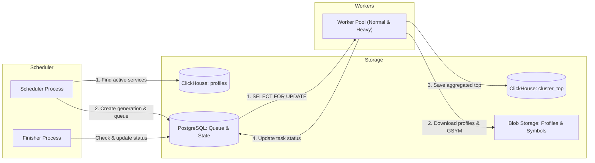

# Cluster Top



This doc is AI-generated. It can serve, in particular, as a summarized context of how the component works.



## Overview

The **Cluster Top** component is responsible for pre-calculating and aggregating the top functions across all profiles for each service over specific time intervals, which are called *generations*.

This is necessary for the fast display of the cluster top in the user interface (UI) without having to download and aggregate thousands of raw profiles "on the fly".

## Architecture and Databases

The Cluster Top relies on two main databases:

1. **PostgreSQL** — used as a task queue and to store the state of generations:

   - `cluster_top_generations` — stores information about generations (generation ID, time interval `from_ts` / `to_ts`, status `scheduled` or `finished`).
   - `cluster_top_services` — the queue of services to be processed within a generation. Contains the service name, number of profiles, execution status (`ready`, `done`, `failed`), and a `heavy` flag (to distinguish particularly heavy services with a large number of profiles).

2. **ClickHouse** — acts as the source of data about existing profiles and the target storage for the aggregated results:

   - The initial data is taken from the profile metadata table `profiles`.
   - The results are written to the `cluster_top` table, which stores the pre-calculated values (generation, service, function, self cycles, cumulative cycles).

## Main Components

### Scheduler

The [Scheduler](./scheduler/scheduler.go) is responsible for regularly creating new generations and populating the task queue.

- **Run interval:** once a minute (using a distributed lock - lease).
- **Execution logic:**
  - Calculates the time interval for the next generation, taking into account the `ProfileLag` (profile arrival delay) and `GenerationInterval` (duration of the generation itself) settings.
  - Queries the `profiles` table in ClickHouse to find the most active services for the calculated period.
  - Creates a new record in PostgreSQL in the `cluster_top_generations` table with the `scheduled` status.
  - Populates the `cluster_top_services` table with the list of found services (tasks get the `ready` status).
- **Generation Finisher:** a background process in the scheduler that checks every 30 seconds if all services in a generation have been processed (no records with the `ready` status). If all services are processed, the generation's status is changed to `finished`.

### Worker

The Workers are responsible for the actual data aggregation. They run concurrently, taking tasks from PostgreSQL. The main logic is located in [cluster_top.go](./cluster_top.go).

- **Task selection:** a worker takes a task from the `cluster_top_services` queue using `SELECT ... FOR UPDATE SKIP LOCKED`, which prevents the same task from being taken by multiple workers simultaneously. See [PgServiceSelector](./pg_service_selector.go).
- **Separation into heavy / normal:** services with the highest number of profiles are marked with the `heavy` flag. These tasks are processed by a separate pool of workers with different parallelism settings (one "heavy" service is aggregated in multiple threads, while "normal" services can be aggregated several at a time in parallel).
- **Processing steps:**

  1. Fetches profile metadata for the service for the generation's time interval via `ProfileStorage`.
  2. Downloads the necessary symbol files (GSYM) for the binaries found in the profiles via `ClusterTopSymbolizer`.
  3. Downloads the raw profiles in batches from Blob Storage.
  4. Aggregates the profiles in parallel: builds call trees and extracts the top functions, calculating `self_cycles` and `cumulative_cycles`.
  5. Saves the aggregated result to ClickHouse in the `cluster_top` table via [ClickhousePerfTopAggregator](./clickhouse_perf_top_aggregator.go).
  6. Updates the task status in PostgreSQL to `done` (or `failed` in case of an error).

## Architecture

